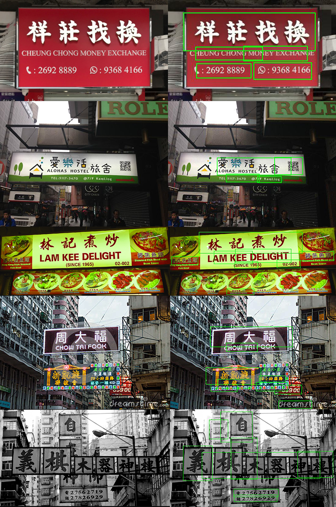

# Scene Text Detection by EAST
Many of the code is copied from https://github.com/SakuraRiven/EAST. Added custom script to control the rotation and scaling of the bounding box about its center. Trained on data of signboards in mainland China.

Performance:

